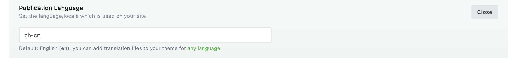

# 背景
UI部门需要记录内部设计规范和设计元素，找到前端部门帮忙搭建一个网站，了解需要后发现他们需要编辑器+列表+文章展示，我发现这就是标准博客网站，就开始找开源的博客系统，最终确定使用ghost，基于Node.js开发，对前端友好，不需要找后端帮忙。

## 汉化过程
打开ghost后台设置语言zh-cn，非常重要！

### 坑
本人用的主题库是`https://ghost.org/themes/liebling/`，内部默认有多语言文件，切到中文后发现日期不汉化，找了各种资料说改core代码，研究源码之后发现，日期用的是moment，最终调用了dateMoment.locale(options.data.site.locale)，这个local取的是ghost后台设置语言，匹配主题包下locals文件夹下的文件名，liebling中文是zh-hans.json，导致日期不汉化，把文件名改成zh-cn就好了
